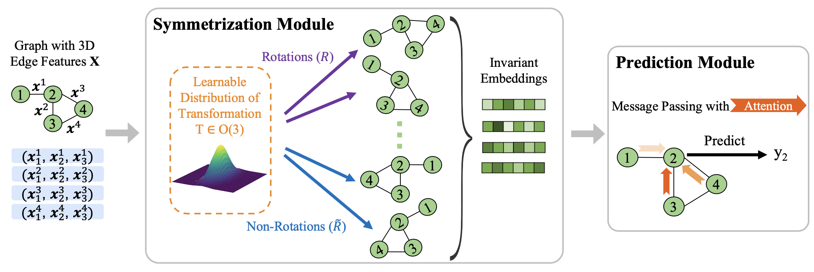
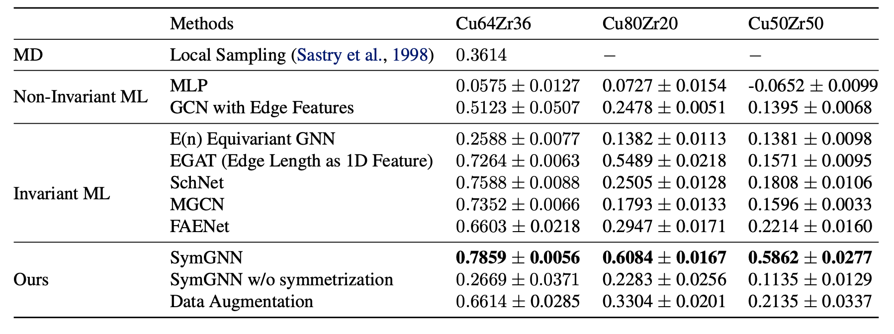
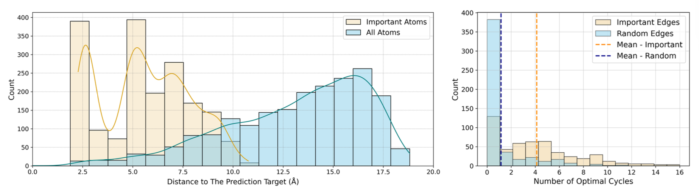

# Predicting and Interpreting Energy Barriers of Metallic Glasses with Graph Neural Networks

Code for ICML 2024 [Predicting and Interpreting Energy Barriers of Metallic Glasses with Graph Neural Networks](https://arxiv.org/abs/2401.08627)

## Task

Metallic Glasses (MGs) are widely used materials that combine the traits of metals, plastics, and glasses. One important quantity that are believed to govern most of the important properties of MGs is energy barrier. To bolster the material science community's study of this important quantity, we propose noval GNN architectures that can accurately predicts it and also generates valuable explanations regarding why certain atomic sturctures are more important when deciding this quantity.

## Model Architecture

We integrate a noval symmetrization module to handle E(3)-invariance on top of a GNN message passing module.

<p align="center">
  <br />
  
  <br />
</p>

## Getting Started

### Datasets
The raw dataset can be found under the folder `datasets/raw_data`, the script `construct_graph.py` can be used to construct the dgl graphs consistent with the setting in the paper.

### Models
All models and baselines implementatition can be found in `models.py` under models folder. We borrow the `MGCN`, `MPNN`, and `SchNet` implementation from the DIG library.
The GNNExplainer is adopted from the DGL library. The training routine can be found in `train.py`, and the model config can all be located in `train.conf.yaml`.

### Usage
- Train GNNs on the Energy Barrier Regression Task
```bash
python3 train.py --model_name='symgnn' --output_dir='./outputs/symgnn' --device=0 --console_log --log_level=10 --learning_rate=0.0001 --patience=100 --max_epoch=20000 --eval_interval=10
```

## Prediction Results

Comparing with other baselines and ablations, SymGNN shows supriority both in terms of prediction score and training speed.

<p align="center">
  <br />
  
  <br />
</p>
<!-- |               | Methods                        | Cu64       | Testing Scores          |
|---------------|--------------------------------|-------------------------|-------------------------|
| MD            | Local Sampling                 | -                       | 0.3614                  |
| **Non-Invariant ML** |                            |                         |                         |
|               | MLP                            | 0.2569 ± 0.0096          | 0.0575 ± 0.0127         |
|               | GCN with Edge Features         | 0.8142 ± 0.0161          | 0.5123 ± 0.0507         |
| **Invariant ML** |                               |                         |                         |
|               | E(n) Equivariant GNN           | 0.4526 ± 0.0005          | 0.2588 ± 0.0077         |
|               | EGAT (Edge Length as 1D Feature)| 0.7221 ± 0.0049          | 0.7264 ± 0.0063         |
|               | SchNet                         | 0.7858 ± 0.0059          | 0.7588 ± 0.0088         |
|               | MGCN                           | 0.7531 ± 0.0071          | 0.7352 ± 0.0066         |
|               | FAENet                         | 0.8633                   | 0.6352                  |
|               | Equiformer                     | Training > 2 days        | -                       |
|               | DimeNet                        | Training > 2 days        | -                       |
| **Ours**       |                                |                         |                         |
|               | SymGNN                         | 0.8368 ± 0.0027          | **0.7859 ± 0.0056**     |
|               | SymGNN w/o symmetrization      | 0.8736 ± 0.0007          | 0.2669 ± 0.0371         |
|               | Data Augmentation              | 0.6614 ± 0.0285          |  -->

## Explanation Results

We connect results from GNNExplainer with topological data analysis (TDA), building an important bridge in the study of energy barriers. We found that the high importance edges calculated by the GNNExplainer typically involved in more cycles when considering from a persistent homology perspective.

<p align="center">
  <br />
  
  <br />
</p>